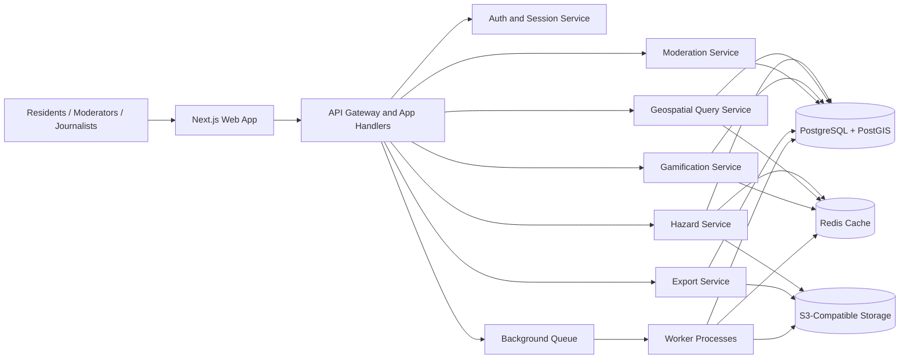
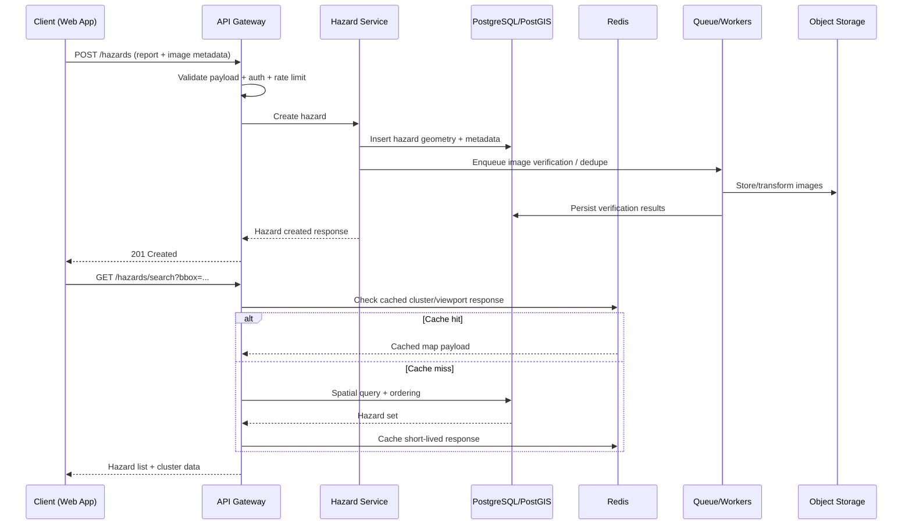

# Architecture

P(l)otHole is designed as a modular civic platform that prioritizes geospatial performance, public transparency, and straightforward deployment. This document describes the service boundaries, request flows, and scaling strategy for the initial and mid-term phases.

## System Goals

- Keep hazard reporting and map browsing fast at city scale.
- Preserve a clear public audit trail for civic accountability.
- Support open data exports (GeoJSON, CSV, API) without impacting core traffic.
- Allow independent scaling of API, cache, and background processing components.

## High-Level Layered Design

### Frontend Layer

- **Framework:** Next.js 14 (App Router) with TypeScript.
- **Responsibilities:** interactive map UI, hazard report form, leaderboard pages, moderation views, and profile pages.
- **Map rendering:** Mapbox GL JS (primary) with Leaflet-compatible abstractions for fallback paths.
- **Auth state:** session-based auth handled by secure HTTP-only cookies.

### API and Application Layer

- **Runtime:** Node.js API (Express or tRPC-backed handlers behind Next.js route handlers/API routes).
- **Responsibilities:**
  - hazard CRUD and voting endpoints
  - search-by-radius and clustering requests
  - profile, badges, leaderboard, and export endpoints
  - moderation and governance workflows
- **Gateway concerns:** request validation, authentication checks, rate limiting, and response shaping.

### Data Layer

- **Primary store:** PostgreSQL with PostGIS.
- **Core use cases:**
  - geospatial indexing and radius queries (`ST_DWithin`, `ST_Distance`, `ST_ClusterDBSCAN`)
  - transactional updates for reports, votes, and audit events
  - strong consistency for hazard lifecycle and moderation actions

### Cache and Derived Data Layer

- **Cache store:** Redis.
- **Use cases:**
  - hot map tiles and cluster summaries
  - leaderboard snapshots
  - short-lived API response caching for heavy aggregate reads
  - request throttling counters and abuse-control primitives

### Object Storage and Media Layer

- **Storage:** S3-compatible object storage for hazard images.
- **Pattern:** metadata in PostgreSQL, binary assets in object storage.
- **Validation:** image integrity checks and metadata verification occur before persisting references.

### Background Processing Layer

- **Workers/queues:** asynchronous jobs for image processing, deduplication checks, leaderboard recalculation, and export generation.
- **Motivation:** isolate expensive tasks from synchronous API paths to preserve low-latency user requests.

## Service Boundary Diagram

## Geospatial Pipeline

Geospatial performance is central to the product. The pipeline favors indexed geometry operations and bounded query windows.

1. **Ingestion:** client submits latitude/longitude (and optional EXIF hints) with a hazard report.
2. **Validation:** API validates coordinate range, proximity sanity checks, and duplicate likelihood.
3. **Persistence:** hazard is written as a PostGIS `POINT` geometry with spatial indexes.
4. **Aggregation:** cluster and heatmap-friendly summaries are computed on-demand or precomputed in cache.
5. **Delivery:** map viewport queries fetch only hazards intersecting current bounds with pagination.

### Geospatial Query Strategy

- Use a `GIST` index on geometry columns for fast radius/bounding-box lookup.
- Prefer viewport bounding-box + limit/offset pagination for map browsing.
- Use Redis for frequently requested city-center clusters and leaderboard-adjacent overlays.
- Offload expensive recalculations to background workers where possible.

## Hazard Request Flow (Report + Map Refresh)

## Auth Flow and API Gateway

- **Session model:** authenticated users receive signed, HTTP-only session cookies.
- **Access control:** middleware enforces route-level checks (public read, authenticated write, moderator-only actions).
- **Gateway protections:** schema validation, rate limiting, and standardized error envelopes.
- **Auditability:** write operations (report edits, status changes, moderation actions) emit audit log records.

## Caching Strategy

- **What is cached:**
  - viewport-based map results with short TTL
  - leaderboard snapshots with scheduled refreshes
  - expensive aggregate counters used on dashboards
- **What is not cached aggressively:**
  - moderation and governance actions that need current state
  - critical hazard lifecycle transitions
- **Invalidation triggers:**
  - new report creation or vote updates
  - status transitions (reported -> scheduled -> resolved)
  - moderation edits affecting visibility/ranking

## Deployment Topology

- **Frontend:** Vercel-hosted Next.js app.
- **API and workers:** containerized services (Docker) in managed runtime.
- **Stateful dependencies:** managed PostgreSQL/PostGIS, managed Redis, S3-compatible object storage.
- **Observability:** central logs, request traces, worker metrics, and alerting on queue lag and API latency.

## Scalability and Reliability Notes

- Start with a modular monolith API and split services only when load justifies separation.
- Keep geospatial queries bounded to viewport/radius scopes to avoid full-table scans.
- Use background jobs for non-blocking enrichment (image verification, exports, recomputation).
- Apply backpressure via rate limiting and queue depth thresholds during traffic spikes.
- Maintain periodic backups and tested restore workflows for database and object storage.

## Future Architecture Extensions

- Multi-city partitioning strategy (logical tenancy by city/region).
- Public streaming feeds for civic dashboards and newsroom integrations.
- ML-assisted duplicate detection and hazard type classification.
- Federated open-data adapters for external map/data ecosystems.
