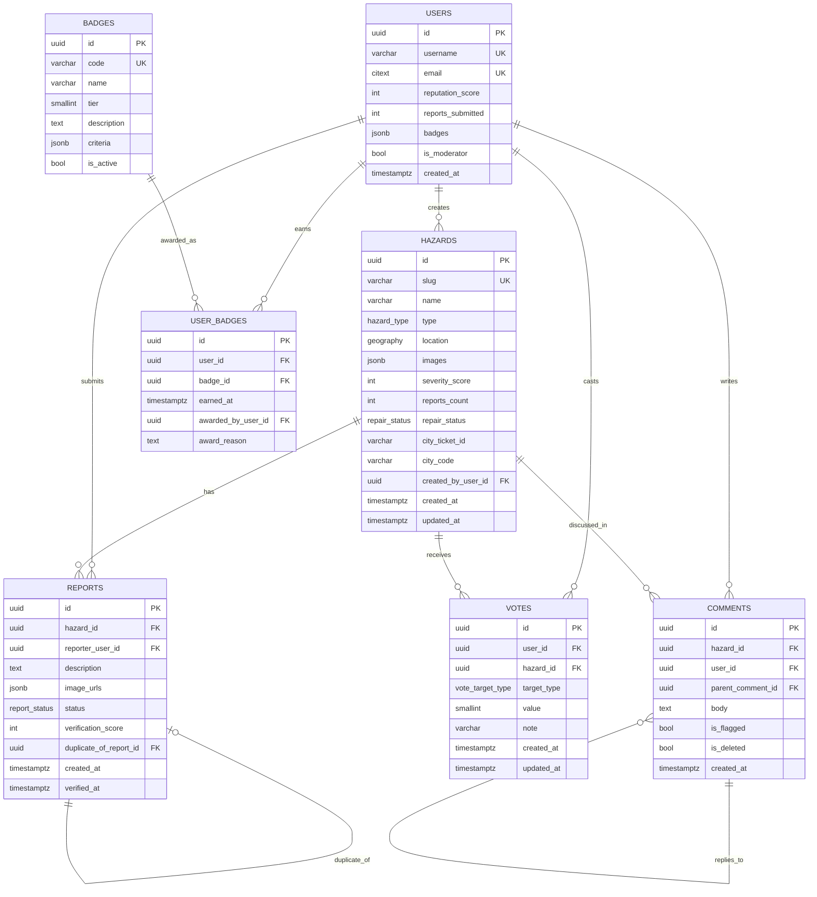

# Data Model

This document defines the core relational schema for P(l)otHole, including geospatial storage, integrity constraints, and relationship design for hazard reporting, voting, and gamification.

## Design Principles

- Keep public hazard data highly queryable and export-friendly.
- Use PostGIS for accurate geospatial querying and indexing.
- Preserve moderation/auditability through immutable event-style tables where possible.
- Separate core entities from derived counters so aggregates can be recalculated safely.

## Database Platform Assumptions

- **Database:** PostgreSQL 15+
- **Extensions:** `postgis`, `pgcrypto` (optional for UUID generation)
- **Timezone policy:** store all timestamps in UTC using `timestamptz`
- **Primary keys:** UUID preferred for public-facing entities

## Enum Types

```sql
CREATE TYPE hazard_type AS ENUM (
  'pothole',
  'crack',
  'sinkhole',
  'drainage',
  'debris'
);

CREATE TYPE repair_status AS ENUM (
  'reported',
  'acknowledged',
  'scheduled',
  'in_progress',
  'resolved',
  'disputed'
);

CREATE TYPE report_status AS ENUM (
  'pending',
  'verified',
  'rejected'
);

CREATE TYPE vote_target_type AS ENUM (
  'hazard',
  'name_proposal'
);
```

## Core Tables

### `hazards`

Canonical record for each map-visible road hazard.

| Column | Type | Constraints / Notes |
|---|---|---|
| `id` | `uuid` | PK, default `gen_random_uuid()` |
| `name` | `varchar(120)` | nullable until first accepted community name |
| `slug` | `varchar(140)` | unique, generated from accepted name |
| `description` | `text` | nullable |
| `type` | `hazard_type` | not null |
| `location` | `geography(POINT, 4326)` | not null; lat/lng stored as PostGIS point |
| `images` | `jsonb` | not null default `'[]'::jsonb` |
| `severity_score` | `integer` | not null default `0`; denormalized aggregate |
| `upvotes` | `integer` | not null default `0` |
| `downvotes` | `integer` | not null default `0` |
| `reports_count` | `integer` | not null default `1` |
| `repair_status` | `repair_status` | not null default `'reported'` |
| `city_ticket_id` | `varchar(80)` | nullable; external municipality ticket |
| `city_code` | `varchar(32)` | not null; supports multi-city rollout |
| `created_by_user_id` | `uuid` | FK -> `users.id`, nullable if anonymous import |
| `created_at` | `timestamptz` | not null default `now()` |
| `updated_at` | `timestamptz` | not null default `now()` |
| `resolved_at` | `timestamptz` | nullable |
| `deleted_at` | `timestamptz` | nullable soft delete marker |

Suggested indexes:

- `CREATE UNIQUE INDEX hazards_slug_key ON hazards(slug) WHERE slug IS NOT NULL;`
- `CREATE INDEX hazards_location_gix ON hazards USING GIST(location);`
- `CREATE INDEX hazards_status_created_idx ON hazards(repair_status, created_at DESC);`
- `CREATE INDEX hazards_city_idx ON hazards(city_code);`

### `users`

Application user identity and contribution profile.

| Column | Type | Constraints / Notes |
|---|---|---|
| `id` | `uuid` | PK, default `gen_random_uuid()` |
| `username` | `varchar(40)` | unique, not null |
| `email` | `citext` | unique, not null |
| `password_hash` | `text` | nullable for OAuth-only accounts |
| `reputation_score` | `integer` | not null default `0` |
| `reports_submitted` | `integer` | not null default `0` |
| `votes_cast` | `integer` | not null default `0` |
| `badges` | `jsonb` | not null default `'[]'::jsonb` (cache of earned badges) |
| `is_moderator` | `boolean` | not null default `false` |
| `is_banned` | `boolean` | not null default `false` |
| `last_active_at` | `timestamptz` | nullable |
| `created_at` | `timestamptz` | not null default `now()` |
| `updated_at` | `timestamptz` | not null default `now()` |

Suggested indexes:

- `CREATE UNIQUE INDEX users_username_key ON users(username);`
- `CREATE UNIQUE INDEX users_email_key ON users(email);`
- `CREATE INDEX users_reputation_idx ON users(reputation_score DESC);`

### `votes`

Individual vote events used to compute hazard severity and ranking.

| Column | Type | Constraints / Notes |
|---|---|---|
| `id` | `uuid` | PK, default `gen_random_uuid()` |
| `user_id` | `uuid` | FK -> `users.id`, not null |
| `hazard_id` | `uuid` | FK -> `hazards.id`, nullable when voting on other targets |
| `target_type` | `vote_target_type` | not null default `'hazard'` |
| `value` | `smallint` | not null, check `value between 1 and 5` |
| `note` | `varchar(280)` | nullable |
| `created_at` | `timestamptz` | not null default `now()` |
| `updated_at` | `timestamptz` | not null default `now()` |

Integrity and dedupe rules:

- One active vote per user per hazard:
  - `CREATE UNIQUE INDEX votes_user_hazard_unique ON votes(user_id, hazard_id) WHERE hazard_id IS NOT NULL;`
- Fast aggregate reads:
  - `CREATE INDEX votes_hazard_idx ON votes(hazard_id, created_at DESC);`
  - `CREATE INDEX votes_user_idx ON votes(user_id, created_at DESC);`

### `reports`

Report submissions that either create a new hazard or reinforce an existing one.

| Column | Type | Constraints / Notes |
|---|---|---|
| `id` | `uuid` | PK, default `gen_random_uuid()` |
| `hazard_id` | `uuid` | FK -> `hazards.id`, not null |
| `reporter_user_id` | `uuid` | FK -> `users.id`, nullable for anonymous submissions |
| `description` | `text` | not null |
| `image_urls` | `jsonb` | not null default `'[]'::jsonb` |
| `source_latitude` | `numeric(9,6)` | nullable raw lat for forensic checks |
| `source_longitude` | `numeric(9,6)` | nullable raw lng for forensic checks |
| `status` | `report_status` | not null default `'pending'` |
| `verification_score` | `integer` | not null default `0` |
| `duplicate_of_report_id` | `uuid` | self-FK -> `reports.id`, nullable |
| `created_at` | `timestamptz` | not null default `now()` |
| `verified_at` | `timestamptz` | nullable |

Suggested indexes:

- `CREATE INDEX reports_hazard_idx ON reports(hazard_id, created_at DESC);`
- `CREATE INDEX reports_status_idx ON reports(status, created_at DESC);`
- `CREATE INDEX reports_reporter_idx ON reports(reporter_user_id, created_at DESC);`

### `comments`

Threaded community discussion on hazard records.

| Column | Type | Constraints / Notes |
|---|---|---|
| `id` | `uuid` | PK, default `gen_random_uuid()` |
| `hazard_id` | `uuid` | FK -> `hazards.id`, not null |
| `user_id` | `uuid` | FK -> `users.id`, not null |
| `parent_comment_id` | `uuid` | self-FK -> `comments.id`, nullable |
| `body` | `text` | not null |
| `is_flagged` | `boolean` | not null default `false` |
| `is_deleted` | `boolean` | not null default `false` |
| `created_at` | `timestamptz` | not null default `now()` |
| `updated_at` | `timestamptz` | not null default `now()` |

Suggested indexes:

- `CREATE INDEX comments_hazard_idx ON comments(hazard_id, created_at DESC);`
- `CREATE INDEX comments_parent_idx ON comments(parent_comment_id);`
- `CREATE INDEX comments_user_idx ON comments(user_id, created_at DESC);`

### `badges`

Catalog of possible badges and progression metadata.

| Column | Type | Constraints / Notes |
|---|---|---|
| `id` | `uuid` | PK, default `gen_random_uuid()` |
| `code` | `varchar(40)` | unique, not null (e.g., `spotter`) |
| `name` | `varchar(80)` | not null |
| `tier` | `smallint` | not null; increasing level of difficulty |
| `description` | `text` | not null |
| `criteria` | `jsonb` | not null; machine-readable qualification rules |
| `is_active` | `boolean` | not null default `true` |
| `created_at` | `timestamptz` | not null default `now()` |

Suggested indexes:

- `CREATE UNIQUE INDEX badges_code_key ON badges(code);`
- `CREATE INDEX badges_tier_idx ON badges(tier);`

### `user_badges`

Join table recording earned badges and attribution context.

| Column | Type | Constraints / Notes |
|---|---|---|
| `id` | `uuid` | PK, default `gen_random_uuid()` |
| `user_id` | `uuid` | FK -> `users.id`, not null |
| `badge_id` | `uuid` | FK -> `badges.id`, not null |
| `earned_at` | `timestamptz` | not null default `now()` |
| `awarded_by_user_id` | `uuid` | FK -> `users.id`, nullable for automatic awards |
| `award_reason` | `text` | nullable |

Constraint:

- `CREATE UNIQUE INDEX user_badges_unique ON user_badges(user_id, badge_id);`

## Relationship Notes

- `users` 1-to-many `hazards` (creator relationship).
- `hazards` 1-to-many `reports`, `votes`, and `comments`.
- `users` 1-to-many `reports`, `votes`, and `comments`.
- `users` many-to-many `badges` via `user_badges`.
- `comments` supports hierarchical threads via `parent_comment_id`.

## ER Diagram



## Operational Considerations

- Recalculate `hazards.severity_score`, `hazards.upvotes`, and `hazards.downvotes` from `votes` in background jobs to guard against drift.
- Keep `users.badges` as a cache field; `user_badges` remains the source of truth.
- Soft-delete hazards and comments to preserve transparency/audit history.
- Partition very large `reports` and `votes` tables by month or city once row counts justify it.

## Example Query Patterns

Nearest unresolved hazards:

```sql
SELECT
  h.id,
  h.name,
  h.repair_status,
  h.severity_score,
  ST_Distance(h.location, ST_SetSRID(ST_MakePoint($1, $2), 4326)::geography) AS distance_m
FROM hazards h
WHERE h.deleted_at IS NULL
  AND h.repair_status IN ('reported', 'acknowledged', 'scheduled', 'in_progress')
  AND ST_DWithin(h.location, ST_SetSRID(ST_MakePoint($1, $2), 4326)::geography, $3)
ORDER BY distance_m ASC
LIMIT 100;
```

Weekly top contributors:

```sql
SELECT
  u.id,
  u.username,
  SUM(CASE WHEN r.id IS NOT NULL THEN 10 ELSE 0 END) +
  SUM(CASE WHEN v.id IS NOT NULL THEN 2 ELSE 0 END) AS weekly_points
FROM users u
LEFT JOIN reports r ON r.reporter_user_id = u.id
  AND r.created_at >= date_trunc('week', now())
LEFT JOIN votes v ON v.user_id = u.id
  AND v.created_at >= date_trunc('week', now())
GROUP BY u.id, u.username
ORDER BY weekly_points DESC
LIMIT 100;
```
